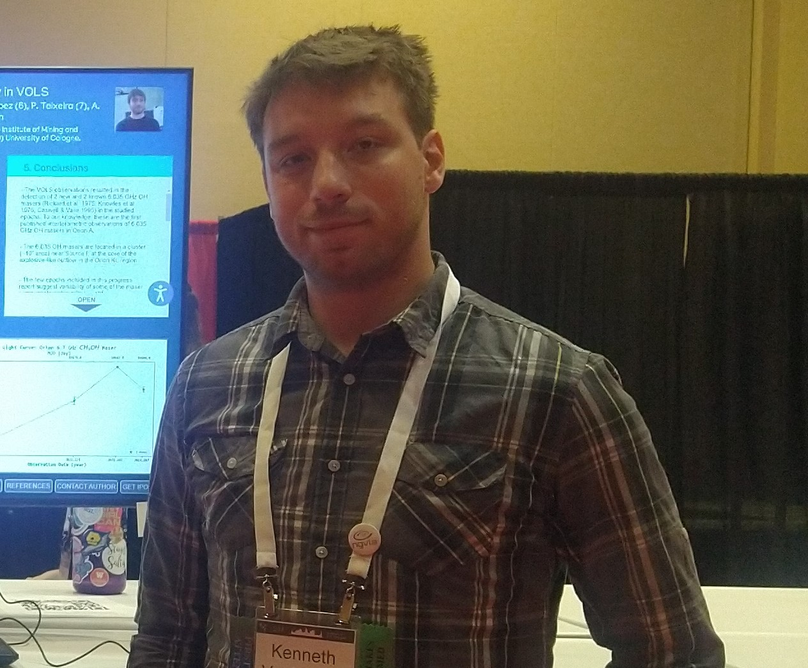

  

<h1 align="center">
  Kenneth VanZuiden (Testing page)
</h1>

This is my first attepmt to make a GitHub page!

## Table Of Contents

1. [About Me](#About-Me)
2. [Education & Trainings](#Education-&-Trainings)
3. [Work Experiance](#Work-Experiance)

## About Me

I am an undergraduate Physics student at Western Illinois University.

## Education & Trainings

Bachelor of Science in Physics		                                                                 Fall 2024
Minors: Computer Science & Mathematics                                                               GPA: 3.6/4.0
Western Illinois University, Macomb, IL
	- Studied physics concepts used in fields of Engineering, Technology, and Science. Including Classical Dynamics, Computational Methods, Electronics, and Optics.
	- Studied Computer Science topics of more advanced programing techniques involving C++, Python, Java, and SQL.
	

Associates of Science		                                                                         Spring 2020
Black Hawk College, Moline, IL                                                                       GPA: 3.2/4.0
	- Studied general arts and sciences. Gained proficiency in many subject areas.

## Work Experiance

Firearms Assembler		                                                                             November 2022 to Current
Springfield Armory Inc., Geneseo, IL                                           
	- Assembled multiple firearms models involving individual detailed procedures. Ensuring product quality and safety.
	- Using hand tools, finishing machenry, and other specialized tools to fit parts.
	- Actively participating in newly implemented company policy of lean manufacturing processes and 5S (Sort,Set,Shine,Standardize,Sustain).
